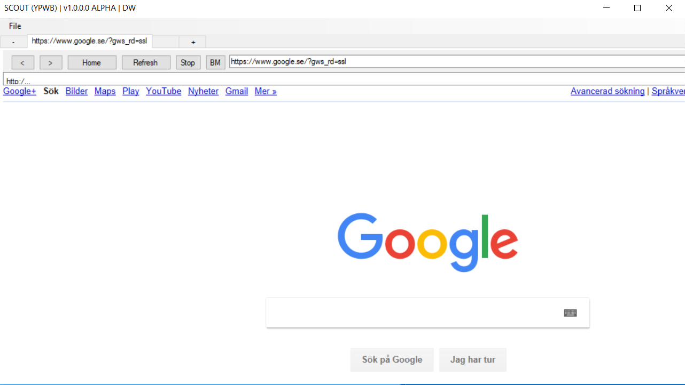

# Scout
A more advanced webbrowser, created from several tutorials, using Axwebbrowser
We use .net and visual basic.

# Sources

* Tutorial 1 https://www.youtube.com/watch?v=l66AAoBf6yE

* Tutorial 2 https://www.youtube.com/watch?v=BwLzbZPUN5o

There are many more tutorials on the subject, just google for info!

See screenshot below:

